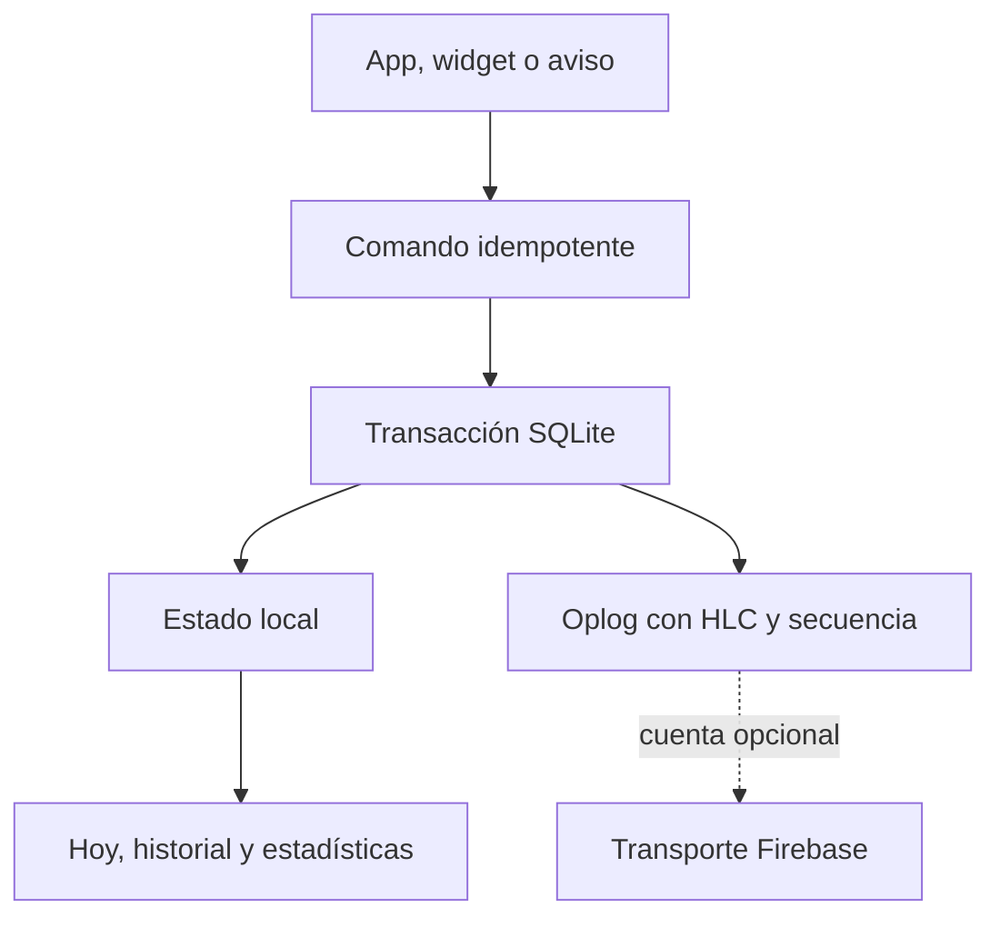

# Arquitectura de Atlas

## Principios

1. **Local-first.** Cada acción se confirma en SQLite antes de intentar sincronizar.
2. **Un solo modelo de comandos.** App, notificaciones y widgets producen la misma operación idempotente.
3. **Historial auditable.** Las mediciones son eventos; una corrección añade un `set` o un override en lugar de reescribir silenciosamente el pasado.
4. **Recurrencia civil.** Los días y horas se guardan como fechas locales para que un cambio de zona horaria no mueva el calendario del usuario.
5. **Nativo solo donde aporta valor.** Expo Router gestiona la app; Android nativo cubre widgets y actualización segura de APK.

## Flujo local

SQLite usa WAL, claves foráneas y una cola de escrituras. `command_receipts` impide aplicar dos veces una pulsación repetida. Cada operación de sincronización recibe una secuencia monotónica por dispositivo y un reloj lógico híbrido.

## Resolución de conflictos

- Las entidades tienen relojes por campo.
- Gana el valor con HLC más reciente; el identificador del dispositivo desempata de forma determinista.
- Los borrados dejan tombstones para impedir que un dispositivo antiguo resucite datos.
- Los segmentos remotos son inmutables, encadenados por SHA-256 y aplicados en orden por dispositivo.
- Un hueco de secuencia detiene la importación; nunca se salta silenciosamente.

Firebase es transporte, no base de datos principal. Cerrar sesión o agotar la cuota no bloquea la aplicación local.

## Recordatorios

Atlas expande recurrencias en alarmas de una sola ejecución. Al completar u omitir una ocurrencia, cancela sus avisos pendientes. Android trata las alarmas exactas como acceso especial: el usuario debe autorizar **Alarmas y recordatorios** además del permiso de notificaciones.

## Actualizaciones

El actualizador acepta solo un APK que cumpla todos estos controles:

- SHA-256 igual al publicado en la Release.
- Package name `atlas_habits.com`.
- `versionCode` superior al instalado.
- Certificado firmante igual al de la aplicación instalada.

La instalación siempre termina en la confirmación visible de Android mediante `PackageInstaller`.

## Coste operativo

El modo local cuesta cero. La sincronización opcional usa únicamente Authentication y Firestore dentro de sus cuotas gratuitas. No se habilitan servicios que exijan facturación.
